# Movie Debate Agent Architecture

## Overview

The Movie Debate Agent is a real-time AI-powered application that orchestrates four AI "lawyer" agents to debate and reach consensus on movie recommendations. The system demonstrates advanced multi-agent reasoning using LangChain, real-time event streaming via MCP (Model Context Protocol), and efficient vector search with FAISS.

## System Architecture

```mermaid
graph TB
    subgraph "Frontend (Next.js 15)"
        UI["🎨 React UI"]
        Cards["MagicCard Components"]
        Modal["UserModal"]
        Stream["AgentStream"]
        Toast["ToastProvider"]
        Hooks["useEventSource Hook"]
    end
    
    subgraph "Backend (FastAPI + MCP)"
        API["🚀 FastAPI Server"]
        Routes["API Routes"]
        MCP["MCP Tools"]
        Agents["LangChain Agents"]
        Chains["LangChain Chains"]
    end
    
    subgraph "Data Layer"
        FAISS["📊 FAISS Index<br/>(Vector Search)"]
        DB["🗄️ PostgreSQL<br/>(Metadata)"]
        Embed["🧠 Sentence<br/>Transformers"]
    end
    
    subgraph "External Services"
        OpenAI["🤖 OpenAI GPT-4"]
        Dataset["📽️ Movie Dataset<br/>(Wikipedia)"]
    end
    
    UI --> Routes
    Cards --> Modal
    Stream --> Hooks
    Hooks --> Routes
    
    Routes --> API
    API --> MCP
    MCP --> Agents
    Agents --> Chains
    Chains --> OpenAI
    
    MCP --> FAISS
    API --> DB
    Embed --> FAISS
    Dataset --> DB
    
    Routes -.-> UI
    MCP -.-> Stream
    
    classDef frontend fill:#3b82f6,stroke:#1e40af,color:#fff
    classDef backend fill:#10b981,stroke:#047857,color:#fff
    classDef data fill:#f59e0b,stroke:#d97706,color:#fff
    classDef external fill:#8b5cf6,stroke:#7c3aed,color:#fff
    
    class UI,Cards,Modal,Stream,Toast,Hooks frontend
    class API,Routes,MCP,Agents,Chains backend
    class FAISS,DB,Embed data
    class OpenAI,Dataset external
```



## Component Breakdown

### Frontend Layer (Next.js 15)

**Technology Stack:**
- Next.js 15 with App Router
- TypeScript for type safety
- Tailwind CSS v4 for styling
- Framer Motion for animations
- Radix UI for accessible components

**Key Components:**
- **MagicCard**: Agent profile cards with live reasoning streams
- **UserModal**: Profile input forms with validation
- **AgentStream**: Real-time display of agent thoughts
- **ToastProvider**: Notifications for round changes
- **useEventSource**: Custom hook for MCP event streaming

**Magic MCP Integration:**
All UI components are generated using Magic MCP for rapid development and consistent design patterns.

### Backend Layer (FastAPI + MCP)

**Technology Stack:**
- FastAPI 1.4 for high-performance API
- LangChain for agent orchestration (REQUIRED)
- MCP (Model Context Protocol) for tool integration
- Uvicorn ASGI server
- Pydantic for data validation

**Core Modules:**

#### MCP Tools (`app/mcp_tools/`)
- **FaissVectorSearchTool**: Semantic movie search
- **OpenAIChatTool**: LLM interaction wrapper
- **TimerGuardTool**: Debate timeout management

#### LangChain Agents (`app/agents/`)
- **AgentLawyer**: Individual debate agent with personality
- **DebateOrchestrator**: Multi-agent coordination and pairing

#### LangChain Chains (`app/chains/`)
- **ProfileChain**: User profile → structured agent personality
- **EliminationChain**: Movie debate and elimination logic

### Data Layer

#### FAISS Vector Store
- **Technology**: Facebook AI Similarity Search (CPU version)
- **Embeddings**: 768-dimensional vectors from `all-mpnet-base-v2`
- **Index Type**: IndexFlatIP (cosine similarity via inner product)
- **Storage**: In-memory with disk persistence

#### PostgreSQL Database
- **Purpose**: Movie metadata storage
- **Schema**: Movies, embeddings, tags, user sessions
- **Performance**: Indexed on frequently queried fields

#### Sentence Transformers
- **Model**: `all-mpnet-base-v2` (768 dimensions)
- **Usage**: Movie plot → vector embeddings
- **Performance**: ~100ms per embedding on CPU

### External Services

#### OpenAI GPT-4
- **Usage**: Agent reasoning, personality generation, debate logic
- **Rate Limiting**: Built-in retry logic with exponential backoff
- **Fallback**: Configurable model switching (GPT-3.5 Turbo)

#### Movie Dataset
- **Source**: Wikipedia Movie Plots (Kaggle)
- **Size**: ~35,000 movies with plot summaries
- **Processing**: Keyword extraction, embedding generation

## Data Flow

### 1. Session Initialization
```
User Profiles → ProfileChain → Agent Personalities → Session Creation
```

### 2. Movie Retrieval
```
Agent Personalities → FaissVectorSearchTool → Candidate Movies → Agent State
```

### 3. Debate Rounds
```
Round Pairing → Agent Debates → EliminationChain → Movie Elimination → Next Round
```

### 4. Real-time Streaming
```
Agent Thoughts → MCP Events → SSE Stream → Frontend Updates
```

### 5. Consensus
```
Final Round → Happiness Scoring → Movie Selection → Session Complete
```

## Event Streaming Architecture

### MCP Event Types
- `session.start` - Debate initialization
- `agent.thought` - Real-time agent reasoning
- `tool.call` - FAISS searches, LLM calls
- `round.begin/end` - Debate round transitions
- `consensus.reached` - Final movie selection

### Frontend Event Handling
```typescript
const { events, isConnected } = useEventSource(sessionId);

// Filter events by type
const agentThoughts = events.filter(e => e.type === 'agent.thought');
const toolCalls = events.filter(e => e.type === 'tool.call');
```

### Backend Event Emission
```python
# MCP tool automatically emits events
@mcp_tool
def vector_search(query: str) -> List[Movie]:
    # Search logic
    results = faiss_index.search(query_embedding)
    
    # Event automatically emitted by MCP decorator
    return results
```

## Performance Characteristics

### Latency Targets
- **API Response**: <200ms for non-LLM endpoints
- **Event Streaming**: <50ms event propagation
- **Vector Search**: <100ms for 5 results from 35k movies
- **LLM Calls**: 2-10s depending on complexity

### Scalability
- **Concurrent Sessions**: 50+ (limited by OpenAI rate limits)
- **Memory Usage**: ~2GB for FAISS index + model
- **Database**: Handles 100k+ movies efficiently

### Reliability
- **Event Stream**: Auto-reconnection with exponential backoff
- **API Calls**: Retry logic with circuit breaker pattern
- **Database**: Connection pooling and health checks

## Security Considerations

### Current State (MVP)
- No authentication required
- CORS enabled for localhost development
- Rate limiting on API endpoints

### Production Readiness
- JWT-based authentication
- API key management
- Input sanitization and validation
- HTTPS enforcement
- Environment-based configuration

## Deployment Architecture

### Development
```
docker-compose up --build
├── Frontend: localhost:3000
├── Backend: localhost:8000  
└── Database: localhost:5432
```

### Production (Future)
- **Frontend**: Vercel/Netlify CDN deployment
- **Backend**: Container orchestration (K8s/ECS)
- **Database**: Managed PostgreSQL (RDS/Supabase)
- **Monitoring**: Prometheus + Grafana
- **Logging**: Structured JSON logs with correlation IDs

## Magic MCP Integration Points

### Component Generation
1. **MagicCard** - Agent profile display with streaming
2. **UserModal** - Profile input with validation
3. **AgentStream** - Live reasoning display
4. **ToastProvider** - Round notifications
5. **PillNavbar** - Bottom action bar
6. **ConsensusPanel** - Final result display

### Tool Integration
- All LangChain tools wrapped with MCP decorators
- Automatic event emission for debugging
- Real-time tool call visualization in UI

## Development Workflow

### 1. Backend Development
```bash
cd backend
poetry install
poetry run uvicorn app.main:app --reload
```

### 2. Frontend Development
```bash
cd frontend
npm install
npm run dev
```

### 3. Full Stack Testing
```bash
docker-compose up --build
# Test at http://localhost:3000
```

### 4. Magic MCP Usage
```
/magic create a card component with:
- Dark theme with gradient border
- Avatar placeholder  
- Live streaming text area
- Click handler for modal
```

This architecture enables rapid development while maintaining production-quality patterns for real-time AI applications. 